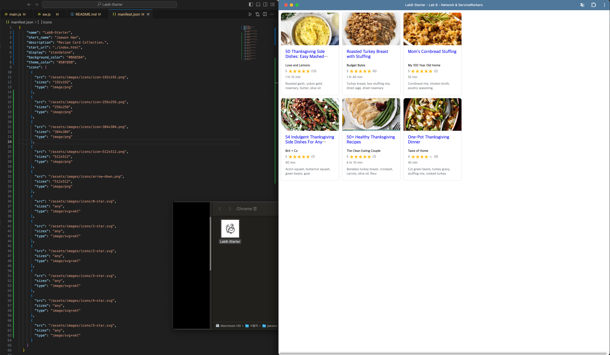

# Lab8-Starter
### Lab Team
Jaewon Han - A17369729

### Deploy GitHub Pages URL
https://rabonghan.github.io/Lab8-Starter/

### Graceful Degradation and Service Workers
1. Graceful degradation: This design allows computer or system to maintain the function (features) when some or most part of the system is unavailable. 
2. Service Workers relate to graceful degradation by enabling web applications to function offline. They intercept network requests and serve cached versions of resources when the network is unavailable. This way is aligned with the principles of graceful degradation. 

### Progressive Web Apps (PWA)
